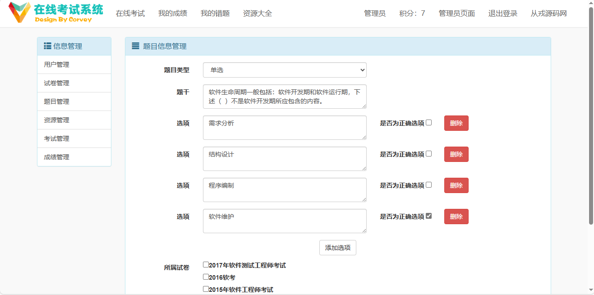

<h1 align="center">50.基于ssh的在线考试管理系统</h1>

 获取sql文件 QQ: 386869957 QQ群: 377586148 

 [推荐站点: 从戎源码网](https://armycodes.com/) 

## 简介

> 本代码来源于网络,仅供学习参考使用!
> 
> 登录地址: http://localhost:8080/login 
> 
> admin 123456
> 

## 项目介绍
基于ssh的在线考试管理系统：前端jsp、jquery、bootstrap，后端 spring、mybatis、Spring Security，集成在线考试、我的成绩、我的错题、资源大全、试卷管理等功能于一体的系统。

## 技术选型

* 前端
    * Html/Css/JavaScript
    * Bootstrap
    * jQuery
    * UploadFive
* 后端
    * Spring/SpringMVC/Hibernate
    * Spring Security
    * slf4j/log4j
    * Gson
    * POI
    * Druid
* 数据库
    * MySQL

## 功能模块图

## ER图

## 环境

- <b>IntelliJ IDEA 2009.3</b>

- <b>Mysql 5.7.26</b>

- <b>Tomcat 7.0.73</b>

- <b>JDK 1.8</b>

## 运行截图

